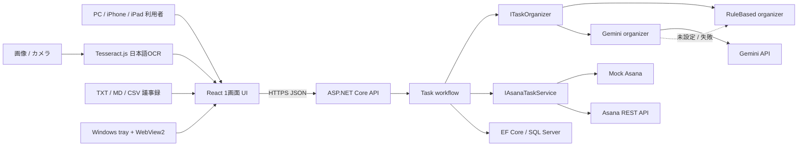
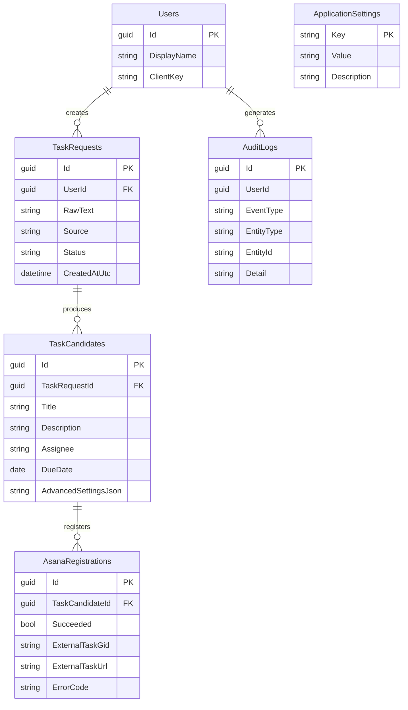

# アーキテクチャ

## システム概要

Task Capture は、React の1画面 UI、ASP.NET Core API、SQL Server、Windows WebView2 ランチャーからなる登録専用アプリである。ブラウザーとランチャーは同じ Web UI を使用し、秘密情報・外部 API 呼び出し・履歴保存はすべて API 側へ閉じ込める。

## コンポーネント

| コンポーネント | 責務 |
|---|---|
| React UI | メイリオUI優先表示、Clipboard、議事録読込、Tesseract.js画像OCR、Web Speech API、候補編集、登録結果表示 |
| Task workflow | 状態遷移、DB 保存、監査、外部サービス呼び出しの調停 |
| RuleBased organizer | API キー不要の決定的なタイトル・担当者・期限抽出 |
| Gemini organizer | GeminiのJSON Schema出力を候補へ変換し、未設定・失敗時はRuleBasedへフォールバック |
| Asana services | Mock と REST API の設定切り替え、候補/既定project/workspaceの登録先解決 |
| EF Core | SQL Server スキーマ、履歴、登録・監査データ |
| Launcher | tray、グローバルホットキー、WebView2、クリップボード橋渡し、自動クローズ |

## API

| Method | Path | 用途 |
|---|---|---|
| GET | `/api/health` | 起動状態、DB/AI/Asana モード確認（秘密情報なし） |
| POST | `/api/task-requests/organize` | 入力保存と候補生成 |
| PUT | `/api/task-candidates/{id}` | 確認・修正した候補の保存 |
| POST | `/api/task-candidates/{id}/register` | 候補保存と Asana/Mock 登録 |
| GET | `/api/task-requests/recent` | 限定的な直近履歴確認 |

## データモデル

テーブルには監査用の UTC 日時を持たせる。入力・候補・エラー詳細は秘密情報を含まない範囲で保持し、PAT や接続文字列は保持しない。

## 状態遷移

`Received → Organized → Edited（任意）→ Registering → Registered / Failed`

整理失敗・登録失敗でも `TaskRequests` と `AuditLogs` を保存し、再現に必要な相関 ID を API Problem Details に返す。

## セキュリティ境界

- ブラウザーには PAT、AI キー、DB 接続文字列を返さない。
- Gemini APIキーはUser Secretsまたは配備先Secret Storeだけから読み、入力本文・キー・SDK設定オブジェクトをログへ出さない。
- 画像・議事録ファイルはブラウザー内で文字化し、ファイル本体をAPI/DBへ送信・保存しない。
- API DTO の文字数・日付・JSON 形式を検証する。
- `HttpClient` の Authorization は Asana 専用クライアントでのみ設定する。
- ログは例外メッセージを必要最小限にし、認証ヘッダー/設定オブジェクトを出力しない。
- MVP は限定ネットワーク内での利用を前提とする。外部公開前に組織認証、TLS 終端、レート制限を追加する。

## 実装根拠と引き継ぎ

人向けのクリック可能な構成図は `docs/architecture.html`、機械可読の module/API/DB/integration/data-flow inventory は `docs/architecture.json`、更新手順は `docs/architecture_readme.md` にある。実 SQL Server/Asana はローカル限定環境で検証済みである。GeminiはSDK・構造化変換・フォールバックのテストまで完了し、再発行したSecretによる実通信、HTTPS配備、端末 QAは inventory の `risks_or_unknowns` に分離している。
