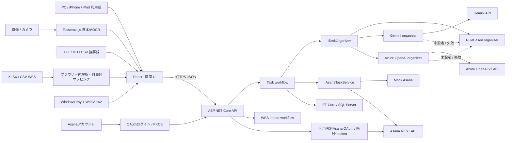
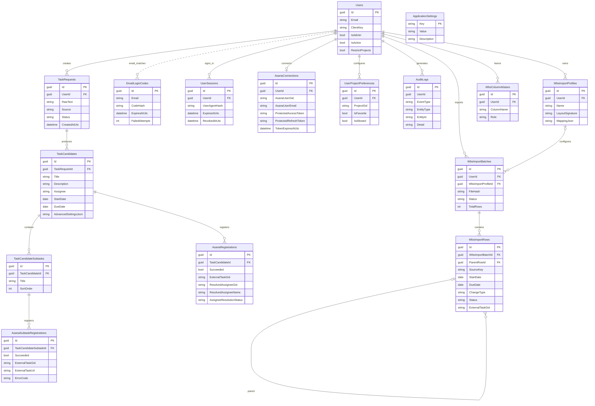
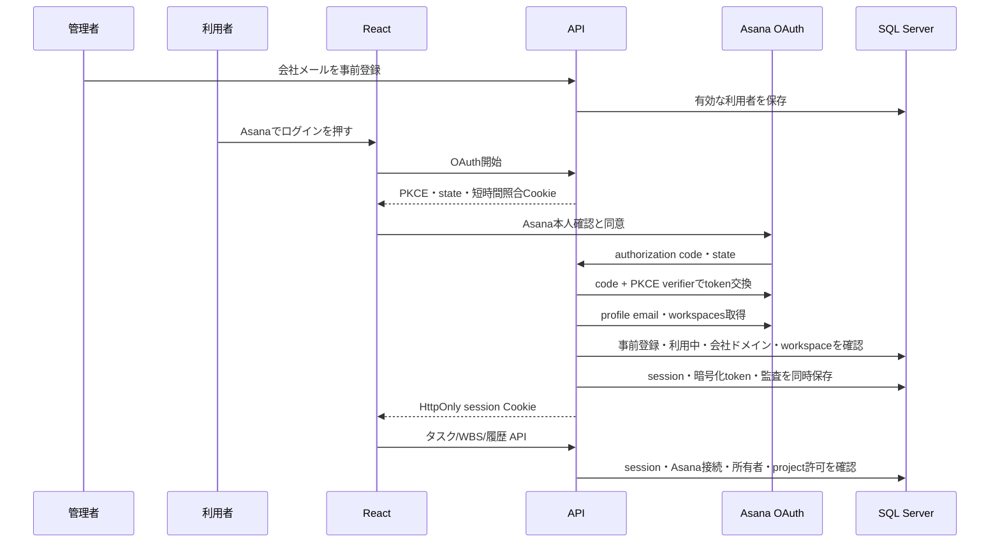
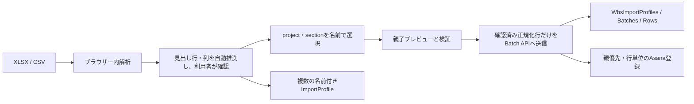

# アーキテクチャ

## システム概要

Task Capture は、React の通常入力／WBS一括取込 UI、ASP.NET Core API、SQL Server、Windows WebView2 ランチャーからなる登録専用アプリである。ブラウザーとランチャーは同じ Web UI を使用し、秘密情報・外部 API 呼び出し・履歴保存はすべて API 側へ閉じ込める。

```mermaid
flowchart LR
    User["PC / iPhone / iPad 利用者"] --> Web["React 1画面 UI"]
    Image["画像 / カメラ"] --> Ocr["Tesseract.js 日本語OCR"] --> Web
    Minutes["TXT / MD / CSV 議事録"] --> Web
    Wbs["XLSX / CSV WBS"] --> Parse["ブラウザー内解析・自由列マッピング"] --> Web
    Tray["Windows tray + WebView2"] --> Web
    Web -->|HTTPS JSON| Api["ASP.NET Core API"]
    AsanaIdentity["Asanaアカウント"] --> Auth["OAuthログイン / PKCE"]
    Auth --> Api
    Api --> Workflow["Task workflow"]
    Api --> WbsWorkflow["WBS import workflow"]
    Workflow --> Organizer["ITaskOrganizer"]
    Workflow --> Asana["IAsanaTaskService"]
    Workflow --> Db["EF Core / SQL Server"]
    Organizer --> Rule["RuleBased organizer"]
    Organizer --> Gemini["Gemini organizer"]
    Organizer --> Azure["Azure OpenAI organizer"]
    Gemini --> GeminiApi["Gemini API"]
    Azure --> AzureApi["Azure OpenAI v1 API"]
    Gemini -. "未設定 / 失敗" .-> Rule
    Azure -. "未設定 / 失敗" .-> Rule
    Asana --> Mock["Mock Asana"]
    Asana --> Real["Asana REST API"]
    Api --> OAuth["利用者別Asana OAuth / 暗号化token"]
    OAuth --> Real
```

## コンポーネント

| コンポーネント | 責務 |
|---|---|
| React UI | メイリオUI優先表示、Clipboard、議事録読込、Tesseract.js画像OCR、Web Speech API、親タスクとサブタスク候補、開始日・期限、登録先の編集、実際に解決された担当者と警告の表示 |
| Auth / settings UI | 1ボタンのAsanaログイン、logout、利用者の事前登録・停止・プロジェクト制限、通常登録履歴検索 |
| WBS UI | 「ファイル → 読取確認 → 登録」の3ステップ、XLSX/CSVのブラウザー内解析、見出し行・列の自動推測、通常は閉じた読取設定、4階層方式、追加項目、登録先選択、検索・絞り込み・親子開閉・100件ごとの表示、登録前の担当者確認、履歴・元に戻す操作 |
| Task workflow | 状態遷移、親子候補のDB保存、監査、親→子の順序制御、部分失敗時の再開 |
| WBS import workflow | 登録前の行単位検証、担当者確認、親の日付集約、前回との差分判定、親優先登録、変更行更新、今回作成分の取り消し、失敗行の再開、取込履歴 |
| RuleBased organizer | API キー不要の決定的なタイトル・担当者・期限抽出と、明示された箇条書きのサブタスク化 |
| Gemini organizer | GeminiのJSON Schema出力を親候補と0〜6件の実行可能なサブタスクへ変換し、未設定・失敗時はRuleBasedへフォールバック |
| Azure OpenAI organizer | Azure OpenAI v1のstrict JSON Schema出力をGeminiと共通の検証処理で候補へ変換し、未設定・失敗時はRuleBasedへフォールバック |
| Asana services | Mock/PAT/利用者別OAuthの切り替え、PKCEログイン、事前登録・会社ドメイン・workspace所属の検証、暗号化token更新、workspaceユーザー名の安全なGID解決、project/section一覧取得、project認可、親子登録 |
| EF Core | SQL Server スキーマ、履歴、登録・監査データ |
| Launcher | tray、グローバルホットキー、WebView2、クリップボード橋渡し、自動拡大、自動非表示、単一起動、Windowsログイン時自動起動 |

## API

| Method | Path | 用途 |
|---|---|---|
| GET | `/api/health` | 起動状態、DB/AI/Asana モード確認（秘密情報なし） |
| GET | `/api/health/ready` | DB・ログイン・Asana・AI・本番安全設定の起動準備確認 |
| GET/POST | `/api/auth/me`, `/api/auth/logout` | ログイン状態とsession管理 |
| GET | `/api/auth/asana/start`, `/api/auth/asana/callback` | Asana OAuthログイン開始・callback |
| POST | `/api/auth/request-code`, `/api/auth/verify-code` | 開発・切替用メール確認コード |
| GET/POST/DELETE | `/api/asana/connection/*` | EmailCode方式向けOAuth接続・状態・解除 |
| POST | `/api/task-requests/organize` | 入力保存と候補生成 |
| PUT | `/api/task-candidates/{id}` | 確認・修正した候補の保存 |
| POST | `/api/task-candidates/{id}/register` | 親候補とサブタスクの保存、Asana/Mockへの親子登録 |
| GET | `/api/task-requests/recent` | 限定的な直近履歴確認 |
| GET | `/api/asana/projects` | workspaceの利用可能project一覧とサーバー既定値を取得 |
| PUT | `/api/asana/projects/{projectGid}/favorite` | 利用者別のお気に入り保存 |
| GET | `/api/asana/projects/{projectGid}/sections` | 選択projectのsection一覧を取得 |
| GET | `/api/asana/projects/{projectGid}/fields` | 選択projectで入力可能な追加項目を取得 |
| GET/POST | `/api/wbs-imports/profiles` | WBS変換テンプレートの一覧・作成 |
| PUT/DELETE | `/api/wbs-imports/profiles/{id}` | テンプレートの更新・削除 |
| POST | `/api/wbs-imports/batches` | 正規化行のserver dry-runとbatch保存 |
| GET | `/api/wbs-imports/batches/{id}` | batch・行別結果の再取得 |
| GET | `/api/wbs-imports/batches` | 直近の取込履歴を取得 |
| GET | `/api/wbs-imports/column-names` | 保存済みの会社独自列名を取得 |
| POST | `/api/wbs-imports/batches/{id}/register` | 親優先のAsana/Mock一括登録と再開 |
| POST | `/api/wbs-imports/batches/{id}/undo` | 今回新しく作ったAsanaタスクだけを取り消す |
| GET | `/api/wbs-imports/batches/{id}/errors.csv` | 未登録行と理由のCSV出力 |
| GET/POST/PUT | `/api/admin/users`, `/api/admin/users/{id}/access` | 利用者の事前登録・停止・管理者・project制限 |
| GET | `/api/admin/audit` | 管理者向け監査イベント |

## データモデル

```mermaid
erDiagram
    Users ||--o{ TaskRequests : creates
    Users o|..o{ EmailLoginCodes : email_matches
    Users ||--o{ UserSessions : signs_in
    Users ||--o| AsanaConnections : connects
    Users ||--o{ UserProjectPreferences : configures
    TaskRequests ||--o{ TaskCandidates : produces
    TaskCandidates ||--o{ TaskCandidateSubtasks : contains
    TaskCandidates ||--o{ AsanaRegistrations : registers
    TaskCandidateSubtasks ||--o{ AsanaSubtaskRegistrations : registers
    Users ||--o{ AuditLogs : generates
    Users ||--o{ WbsImportProfiles : owns
    Users ||--o{ WbsColumnAliases : learns
    Users ||--o{ WbsImportBatches : imports
    WbsImportProfiles o|--o{ WbsImportBatches : configures
    WbsImportBatches ||--o{ WbsImportRows : contains
    WbsImportRows o|--o{ WbsImportRows : parent

    Users { guid Id PK string Email string ClientKey bool IsAdmin bool IsActive bool RestrictProjects }
    EmailLoginCodes { guid Id PK string Email string CodeHash datetime ExpiresAtUtc int FailedAttempts }
    UserSessions { guid Id PK guid UserId FK string UserAgentHash datetime ExpiresAtUtc datetime RevokedAtUtc }
    AsanaConnections { guid Id PK guid UserId FK string AsanaUserGid string AsanaUserEmail string ProtectedAccessToken string ProtectedRefreshToken datetime TokenExpiresAtUtc }
    UserProjectPreferences { guid Id PK guid UserId FK string ProjectGid bool IsFavorite bool IsAllowed }
    TaskRequests { guid Id PK guid UserId FK string RawText string Source string Status datetime CreatedAtUtc }
    TaskCandidates { guid Id PK guid TaskRequestId FK string Title string Description string Assignee date StartDate date DueDate string AdvancedSettingsJson }
    TaskCandidateSubtasks { guid Id PK guid TaskCandidateId FK string Title int SortOrder }
    AsanaRegistrations { guid Id PK guid TaskCandidateId FK bool Succeeded string ExternalTaskGid string ResolvedAssigneeGid string ResolvedAssigneeName string AssigneeResolutionStatus }
    AsanaSubtaskRegistrations { guid Id PK guid TaskCandidateSubtaskId FK bool Succeeded string ExternalTaskGid string ExternalTaskUrl string ErrorCode }
    ApplicationSettings { string Key PK string Value string Description }
    AuditLogs { guid Id PK guid UserId string EventType string EntityType string EntityId string Detail }
    WbsImportProfiles { guid Id PK guid UserId FK string Name string LayoutSignature string MappingJson }
    WbsColumnAliases { guid Id PK guid UserId FK string ColumnName string Role }
    WbsImportBatches { guid Id PK guid UserId FK guid WbsImportProfileId FK string FileHash string Status int TotalRows }
    WbsImportRows { guid Id PK guid WbsImportBatchId FK guid ParentRowId FK string SourceKey date StartDate date DueDate string ChangeType string Status string ExternalTaskGid }
```

全16テーブルに必要な監査用UTC日時を持たせる。PAT・OAuth Client Secret・接続文字列は保持しない。OAuth tokenはData Protection暗号文だけを保持する。`EmailLoginCodes` は開発・切替用EmailCode方式のみで使用する。

## 認証・認可フロー

```mermaid
sequenceDiagram
    participant Admin as 管理者
    participant U as 利用者
    participant W as React
    participant A as API
    participant O as Asana OAuth
    participant D as SQL Server
    Admin->>A: 会社メールを事前登録
    A->>D: 有効な利用者を保存
    U->>W: Asanaでログインを押す
    W->>A: OAuth開始
    A-->>W: PKCE・state・短時間照合Cookie
    W->>O: Asana本人確認と同意
    O->>A: authorization code・state
    A->>O: code + PKCE verifierでtoken交換
    A->>O: profile email・workspaces取得
    A->>D: 事前登録・利用中・会社ドメイン・workspaceを確認
    A->>D: session・暗号化token・監査を同時保存
    A-->>W: HttpOnly session Cookie
    W->>A: タスク/WBS/履歴 API
    A->>D: session・Asana接続・所有者・project許可を確認
```

Productionでは `AsanaOAuth` ログインだけを許可し、Development認証やEmailCodeでの起動を拒否する。`Access:AdminEmails` は最初の管理者だけをサーバー設定で許可するbootstrapで、以後は管理APIの事前登録済みUsersだけがログインできる。APIはfallback policyで認証と有効なAsana接続を既定必須とし、匿名許可はログイン開始・callback、`/api/auth/me`、health、SPAに限定する。利用者IDはHTTP headerから受け取らず、検証済みclaimsから `ICurrentUserContext` が作る安定キーを使う。

Asana OAuthログインはPKCE S256、Data Protectionで保護したstate、HttpOnlyの短時間照合Cookieをすべて検証する。callback後に `/users/me` のemailとworkspacesを取得し、許可会社ドメインの事前登録済みメールかつ `DefaultWorkspaceGid` の社内workspaceに所属する場合だけ、sessionとtokenを保存する。期限2分前からサーバー側でrefreshする。project一覧はAsana権限で絞られ、`RestrictProjects=true` の利用者はさらにアプリ許可一覧を通す。通常ログアウトは現在端末のsessionを失効し、ほかに有効sessionがない時だけAsanaへOAuth解除を要求してローカルtokenを消去する。管理者による利用停止は全sessionとOAuthを即時失効する。

## 状態遷移

`Received → Organized → Edited（任意）→ Registering → Registered / PartiallyRegistered / Failed`

自由文の担当者は `GET /workspaces/{workspace_gid}/users` で取得した名前へ完全一致、次に一意な部分一致を行う。0件・複数件・取得失敗では誤割り当てせず、親タスクを未割り当てで登録して警告を返す。親タスクを先に登録してGIDとAsanaが返した担当者を保存し、その後に同じ担当者GIDでサブタスクを `POST /tasks/{task_gid}/subtasks` から順に登録する。部分失敗時は成功済みの親・子を再作成せず、失敗した子だけを次回再試行する。

## WBS取込の境界

可変レイアウトのExcel/CSV取込は通常の1件入力画面へ混在させず、同じSPA内の独立モードとして実装する。

```mermaid
flowchart LR
    File["XLSX / CSV"] --> Parse["ブラウザー内解析"]
    Parse --> Mapping["見出し行・列を自動推測し、利用者が確認"]
    Mapping --> Destination["project・sectionを名前で選択"]
    Destination --> Preview["親子プレビューと検証"]
    Preview --> Batch["確認済み正規化行だけをBatch APIへ送信"]
    Batch --> Db2["WbsImportProfiles / Batches / Rows"]
    Batch --> Asana2["親優先・行単位のAsana登録"]
    Mapping --> Profile["複数の名前付きImportProfile"]
```

階層は「なし」「識別キー・親キー」「階層レベル」「大項目・中項目等の階層列」から選ぶ。一般的な `大項目 / 中項目 / 小項目` は3つの階層列として自動判定し、取込専用列を要求しない。見出し名から開始日、期限、登録対象を含む列を初期推測し、割り当ての意味を画面内に表示する。利用者はproject/sectionを名前で選び、クライアントpreviewに加えてAPIが日付順、親不足・循環・重複等を再検証する。確認済み結果を `WbsImportProfiles`、`WbsImportBatches`、`WbsImportRows` へ保存し、親優先でAsanaへ登録する。row hashで別batchを含む重複を防ぎ、部分失敗時は成功済み行を飛ばして未完了行だけを再試行する。

WBSのまとまりは `Ready / Invalid → Registering → Registered / PartiallyRegistered / Failed`、取り消し後は `Reverted / PartiallyReverted` となる。行は `Ready / Invalid / Excluded → Registered / Updated / Duplicate / Skipped / Failed / Blocked`、取り消し後は `Reverted / RevertFailed` となる。

## セキュリティ境界

- ブラウザーには PAT、AI キー、DB 接続文字列を返さない。
- 認証cookieはHttpOnly、SameSite=Lax、本番Secureとし、DB sessionの失効・期限・利用者停止を毎回検証する。
- OAuth開始は既定10分で失効し、改ざん防止state、PKCE、照合Cookieをすべて必須とする。全APIはIP/利用者単位の固定窓rate limitを持つ。
- OAuth tokenはData Protection暗号文だけを保存し、鍵フォルダーをDBとは別に永続化・バックアップする。
- task候補、通常履歴、WBS profile/batch、projectお気に入りはclaims由来の利用者へ必ずスコープする。
- Gemini APIキーはUser Secretsまたは配備先Secret Storeだけから読み、入力本文・キー・SDK設定オブジェクトをログへ出さない。
- Azure OpenAIのendpoint、deployment、APIキーはサーバー設定だけから読み、v1 chat completionsへstrict JSON Schemaを送る。APIキー・入力本文・応答本文をログへ出さない。
- 画像・議事録・WBSファイルはブラウザー内で文字化または正規化し、ファイル本体をAPI/DBへ送信・保存しない。
- API DTO の文字数・日付・JSON 形式を検証する。
- `HttpClient` の Authorization は Asana 専用クライアントでのみ設定する。
- ログは例外メッセージを必要最小限にし、認証ヘッダー/設定オブジェクトを出力しない。
- ProductionはSQL Server、AsanaOAuthログイン、社内workspace・必要scope、Azure OpenAI、HTTPS callback、永続Data Protection鍵が揃わないと起動を拒否する。全APIのrate limitとTLS終端を維持する。

## 実装根拠と引き継ぎ

人向けのクリック可能な構成図は `docs/architecture.html`、機械可読の module/API/DB/integration/data-flow inventory は `docs/architecture.json`、更新手順は `docs/architecture_readme.md` にある。Gemini構造化整理、Azure OpenAI adapter、実 SQL Server、通常入力とWBSのAsana限定projectへの担当者付き親子登録、PKCE付きAsanaログインは自動テスト済みである。未確認の本番Azure/Asana OAuth実通信、HTTPS配備と実端末 QAは inventory のリスクまたは次アクションへ分離している。
